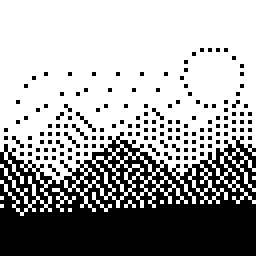

# d0ph1nph0t0

> Tu7n 4ny p1c 1nt0 4 Fl1pp3r Z3r0–r34dy 1-b1t 1m4g3.

A Cursor [Agent Skill](https://cursor.com/docs/agent/skills). Hand it a photo
or a logo, and it spits out images that look right on the Flipper Zero's tiny
black-and-white screen.

## Before and after

<table>
  <tr>
    <th>Original</th>
    <th>Flipper 64×64 (zoomed 4× so you can see it)</th>
    <th>Actual 64×64</th>
  </tr>
  <tr>
    <td></td>
    <td></td>
    <td></td>
  </tr>
  <tr>
    <td></td>
    <td></td>
    <td></td>
  </tr>
</table>

The middle column is the same image as the right column, just blown up 4× with
nearest-neighbor scaling so you can actually see the dither. On the Flipper's
real screen each pixel is much sharper than what your monitor shows you here.

## What you get

For every image you give it, you get back:

- a full-screen 128×64 version (drops straight into a FAP's `images/` folder)
- a square 64×64 version cropped around the face/center (good for menus or
  animations)
- an `.xbm` file if you want to paste the bytes directly into C or mJS code
- a 4× preview PNG so you can actually see what the dither looks like
  without copying it to your Flipper

You can also ask for any other size, like 10×10 for the App Catalog icon or
14×14 for menu rows.

## Why it exists

If you just convert a photo to grayscale and dither it, faces turn into a
black blob because skin and hair end up too close in brightness. This script
brightens the face first, sharpens the edges, then dithers — so eyes, mouths,
and glasses still show up at 64×64.

## Install

Clone it into Cursor's skills folder. The folder name has to be
`flipper-image` (that's what the skill calls itself), even though the repo
is `d0ph1nph0t0`:

```bash
git clone https://github.com/rib3ye/d0ph1nph0t0.git ~/.cursor/skills/flipper-image
```

Cursor picks it up on the next session. After that, just say something like
"make this Flipper-compatible" or "convert this for my Flipper" and the agent
runs the script for you.

You also need Python 3.10+ and Pillow:

```bash
python3 -m venv /tmp/flipperimg-venv
/tmp/flipperimg-venv/bin/pip install --quiet Pillow
```

## Run it yourself

The defaults give you 128×64, 64×64, an XBM, and a 4× preview:

```bash
/tmp/flipperimg-venv/bin/python ~/.cursor/skills/flipper-image/scripts/make_flipper_images.py \
    out/ photo.png
```

Multiple images, with clean names:

```bash
... make_flipper_images.py out/ kid1=p1.png kid2=p2.png
```

Custom sizes (App Catalog icon + menu icon + full-screen splash):

```bash
... make_flipper_images.py out/ \
    --size 10x10:face --size 14x14:face --size 128x64:fit \
    logo=logo.png
```

## Options

```
make_flipper_images.py OUT_DIR SOURCE [SOURCE ...]
                       [--size WxH[:mode]]   replaces defaults; can repeat
                       [--xbm-of WxH]        which size(s) get an XBM
                       [--no-preview]        skip the 4x preview
                       [--gamma N]           brighten the face (default 2.0)
                       [--autocontrast N]    contrast cutoff % (default 5)

SOURCE := <path>  or  <name>=<path>
mode   := fit (letterbox) | face (square crop, biased for portraits)
```

If a face still looks too dark, try `--gamma 2.4`. If white shirts or
backgrounds blow out, try `--gamma 1.6 --autocontrast 2`.

## Using the output in a FAP

Drop the PNGs into `images/` next to your `application.fam`:

```python
App(
    appid="myapp",
    name="My App",
    apptype=FlipperAppType.EXTERNAL,
    entry_point="myapp_app",
    fap_icon="images/myapp_10x10.png",
    fap_icon_assets="images",
    stack_size=2 * 1024,
)
```

ufbt builds them into a generated header. The symbol is `I_<filename>`:

```c
#include <gui/canvas.h>
#include <myapp_icons.h>

static void draw_callback(Canvas* canvas, void* ctx) {
    canvas_clear(canvas);
    canvas_draw_icon(canvas, 0, 0, &I_kid1_128x64);
}
```

If you'd rather skip the asset pipeline, include the XBM directly:

```c
#include "kid1_128x64.xbm"
canvas_draw_xbm(canvas, 0, 0,
    kid1_128x64_width, kid1_128x64_height, kid1_128x64_bits);
```

## What's in the repo

```
.
├── SKILL.md                       # the actual skill (Cursor reads this)
├── README.md                      # you're reading it
├── LICENSE                        # MIT
└── scripts/
    └── make_flipper_images.py     # the converter
```

## License

MIT. See [LICENSE](LICENSE).
